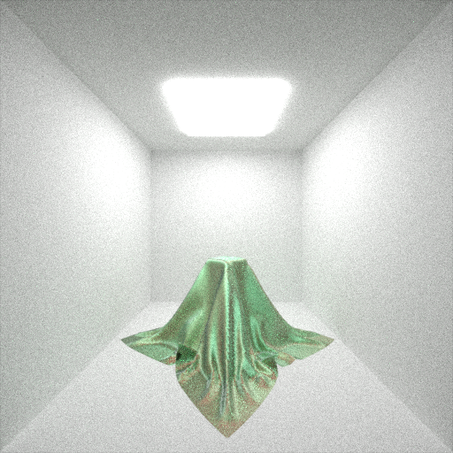
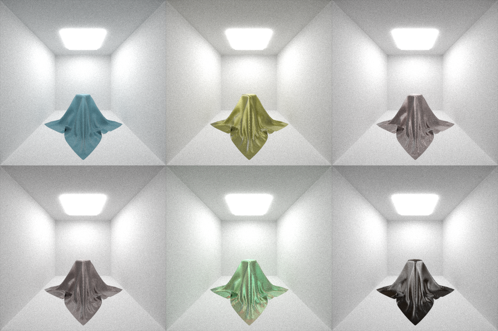

# Path Tracer Cloth

このリポジトリは2020年前期の東京大学大学院創造情報科学専攻の授業「Realistic Image Synthesis」で作成したプログラムが置かれています。

[Realistic Image Synthesis](https://www.ci.i.u-tokyo.ac.jp/~hachisuka/rend2020/)

A Practical Microcylinder Appearance Model for Cloth Renderingという論文（[pdf](http://graphics.ucsd.edu/~henrik/papers/practical_microcylinder_appearance_model_for_cloth_rendering.pdf)）の実装を行いました。

## 実行

```
$ cargo run --release
```

## 実行結果




